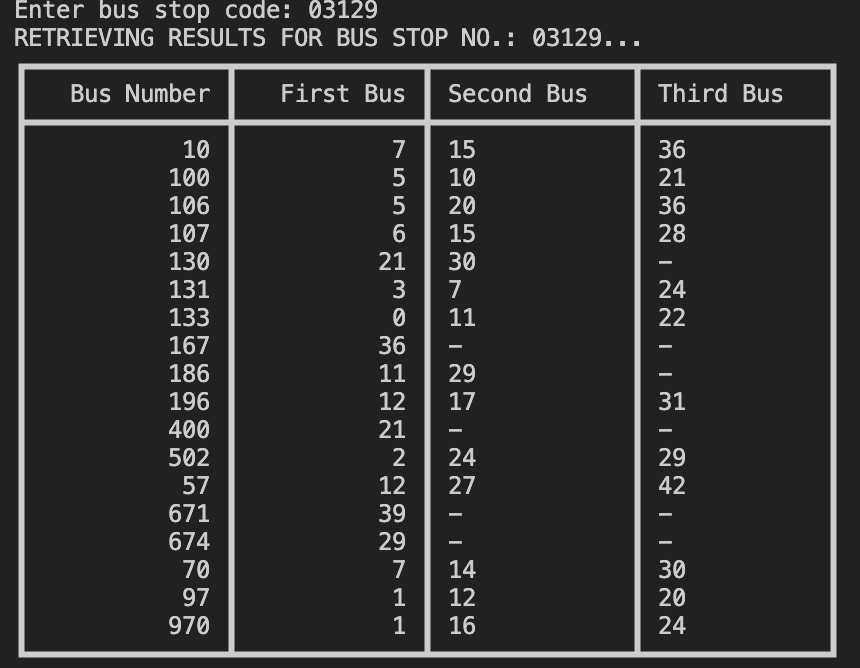

This is a simple application that uses LTA's DataMall API to retrieve bus times based on the bus stop numbers.  
  
Program should be run in the CLI as follows:  
    "python bus-times.py <api-key.txt>"  
where the api-key for LTA DataMall should be pasted as is in the txt file.  
The txt file should be located in the same directory, otherwise please indicate file path accordingly.  
  
The program should print the following:
  
